# DocGemma Connect - Decision Tree Flowchart

```mermaid
flowchart TD
    subgraph Turn["<b>PER-TURN PROCESSING</b>"]
        T1([💬 User Message<br/>+ Optional Image]) --> T2["<b>🖼️ Image Detection</b><br/><i>Pure code: MIME check</i><br/>→ image_present, image_data"]
        T2 --> T3{"<b>🔀 Complexity Router</b><br/><i>LLM + Outlines</i>"}
        T3 -->|"DIRECT<br/>(greeting, simple Q)"| SYNTH
        T3 -->|"COMPLEX<br/>(needs tools)"| T4["<b>📋 Decompose Intent</b><br/><i>LLM + Outlines</i><br/>→ list of subtasks"]
    end

    subgraph Loop["<b>AGENTIC LOOP</b><br/><i>max 3 iterations per subtask</i>"]
        L1["<b>🎯 Plan</b><br/><i>LLM + Outlines</i><br/>Select tool for subtask"]
        L2{"<b>⚡ Execute Tool</b><br/><i>MCP Call</i>"}
        L3{"<b>✅ Check Result</b><br/><i>Pure code</i>"}
        L4{"More<br/>subtasks?"}
        L5{"retries < 3?"}
        
        L1 --> L2
        
        L2 -->|"analyze_medical_image"| TOOL_IMG["🖼️ MedGemma<br/>Vision"]
        L2 -->|"check_drug_safety"| TOOL_FDA["💊 OpenFDA<br/>Warnings"]
        L2 -->|"check_drug_interactions"| TOOL_INT["⚠️ OpenFDA<br/>Interactions"]
        L2 -->|"search_medical_literature"| TOOL_PUB["📚 PubMed"]
        L2 -->|"find_clinical_trials"| TOOL_CT["🔬 ClinicalTrials<br/>.gov"]
        L2 -->|"get_patient_record"| TOOL_EHR["📋 Pseudo-EHR<br/>Read"]
        L2 -->|"update_patient_record"| TOOL_EHRW["✏️ Pseudo-EHR<br/>Write"]
        
        TOOL_IMG --> L3
        TOOL_FDA --> L3
        TOOL_INT --> L3
        TOOL_PUB --> L3
        TOOL_CT --> L3
        TOOL_EHR --> L3
        TOOL_EHRW --> L3
        
        L3 -->|"✓ success"| L4
        L3 -->|"needs_more_action"| L1
        L3 -->|"needs_user_input"| CLARIFY
        L3 -->|"✗ error"| L5
        
        L4 -->|"YES"| L6["Next subtask<br/>reset counters"] --> L1
        L4 -->|"NO"| DONE["✅ All subtasks<br/>complete"]
        
        L5 -->|"YES"| L2
        L5 -->|"NO<br/>(give up)"| PARTIAL["⚠️ Partial<br/>results"]
    end

    subgraph Synth["<b>RESPONSE SYNTHESIS</b>"]
        SYNTH{"Has sufficient<br/>information?"}
        SYNTH -->|"YES"| GEN["<b>📝 Generate Response</b><br/><i>LLM: clinical precision</i><br/><i>technical terminology</i>"]
        SYNTH -->|"NO"| CLARIFY["<b>❓ Request Clarification</b><br/><i>LLM: ask specific Q</i>"]
        GEN --> OUT([📤 Send Response])
        CLARIFY --> OUT
    end

    T4 --> L1
    DONE --> SYNTH
    PARTIAL --> SYNTH
    OUT --> END([🔚 End Turn])

    %% Styling
    style DONE fill:#51cf66,color:#fff,stroke:#2f9e44
    style CLARIFY fill:#ffd43b,color:#000,stroke:#fab005
    style PARTIAL fill:#ff922b,color:#fff,stroke:#e8590c
    
    style TOOL_IMG fill:#e599f7,color:#000,stroke:#be4bdb
    style TOOL_FDA fill:#74c0fc,color:#000,stroke:#339af0
    style TOOL_INT fill:#74c0fc,color:#000,stroke:#339af0
    style TOOL_PUB fill:#74c0fc,color:#000,stroke:#339af0
    style TOOL_CT fill:#74c0fc,color:#000,stroke:#339af0
    style TOOL_EHR fill:#69db7c,color:#000,stroke:#40c057
    style TOOL_EHRW fill:#69db7c,color:#000,stroke:#40c057
    
    style T1 fill:#228be6,color:#fff
    style OUT fill:#228be6,color:#fff
    style END fill:#868e96,color:#fff
```

---

## Node Summary

| Node | Type | Purpose |
|------|------|---------|
| Image Detection | Pure code | Check MIME type for attached images |
| Complexity Router | LLM + Outlines | Classify as direct vs complex |
| Decompose Intent | LLM + Outlines | Break into subtasks |
| Plan | LLM + Outlines | Select tool for current subtask |
| Execute Tool | Pure code (MCP) | Call external tool |
| Check Result | Pure code | Determine next action |
| Synthesize Response | LLM | Generate clinical response |

---

## Tool Inventory

| Tool | Source | Purpose |
|------|--------|---------|
| `analyze_medical_image` | MedGemma Vision | X-ray, CT, MRI, pathology analysis |
| `check_drug_safety` | OpenFDA | FDA boxed warnings |
| `check_drug_interactions` | OpenFDA | Drug-drug interactions |
| `search_medical_literature` | PubMed | Medical literature search |
| `find_clinical_trials` | ClinicalTrials.gov | Recruiting trial search |
| `get_patient_record` | Pseudo-EHR | Read patient data |
| `update_patient_record` | Pseudo-EHR | Write patient data |
