# DocGemma Connect - Decision Tree Flowchart v2

```mermaid
flowchart TD
    subgraph Turn["<b>PER-TURN PROCESSING</b>"]
        T1([💬 User Message<br/>+ Optional Image]) --> T2["<b>🖼️ Image Detection</b><br/><i>Pure code: MIME check</i><br/>→ image_present, image_data"]
        T2 --> T2B["<b>📋 Clinical Context Assembler</b><br/><i>Pure code: no LLM</i><br/>→ patient summary, active meds,<br/>conversation history, image metadata"]
        T2B --> T3{"<b>🔀 Triage Router</b><br/><i>LLM + Outlines</i>"}
        T3 -->|"DIRECT<br/>(greeting, factual Q<br/>from model knowledge)"| SYNTH
        T3 -->|"LOOKUP<br/>(single tool call,<br/>no planning needed)"| FAST["<b>⚡ Fast Tool Path</b><br/><i>Pure code: extract tool + query<br/>from triage output</i>"]
        T3 -->|"REASONING<br/>(clinical reasoning needed,<br/>may need 0-2 tools)"| T4["<b>🧠 Thinking Mode</b><br/><i>LLM extended generation</i><br/>→ clinical reasoning chain<br/>(max 1024 tokens)"]
        T3 -->|"MULTI_STEP<br/>(multiple tools,<br/>decomposition needed)"| T5["<b>📋 Decompose Intent</b><br/><i>LLM + Outlines</i><br/>→ list of subtasks (max 5)"]
    end

    subgraph FastPath["<b>FAST TOOL PATH</b><br/><i>Skip planning — single tool, in and out</i>"]
        FAST --> FP_VAL{"<b>🔍 Validate</b><br/><i>Pure code</i>"}
        FP_VAL -->|"valid"| FP_EXEC["<b>⚡ Execute Tool</b><br/><i>MCP Call</i>"]
        FP_VAL -->|"invalid"| FP_FIX["<b>🔧 Fix Args</b><br/><i>LLM + Outlines</i><br/>Reformulate query"]
        FP_FIX --> FP_EXEC
        FP_EXEC --> FP_CHECK{"success?"}
        FP_CHECK -->|"✓"| SYNTH
        FP_CHECK -->|"✗ error"| FP_RETRY{"retries < 2?"}
        FP_RETRY -->|"YES"| FP_EXEC
        FP_RETRY -->|"NO"| SYNTH
    end

    subgraph Reasoning["<b>REASONING PATH</b><br/><i>Think first, tool if needed</i>"]
        T4 --> R1["<b>🔍 Extract Tool Needs</b><br/><i>LLM + Outlines</i><br/>→ optional tool call<br/>from reasoning chain"]
        R1 -->|"no tools needed"| SYNTH
        R1 -->|"needs tool(s)"| R2["<b>⚡ Execute Tool</b><br/><i>MCP Call</i>"]
        R2 --> R3["<b>🧠 Reasoning Cont.</b><br/><i>LLM extended generation</i><br/>→ reason OVER tool results"]
        R3 --> SYNTH
    end

    subgraph Loop["<b>AGENTIC LOOP</b><br/><i>max 3 iterations per subtask · max 5 subtasks</i>"]
        L1["<b>🎯 Plan</b><br/><i>LLM + Outlines</i><br/>Select tool for subtask"]
        L_VAL{"<b>🔍 Validate<br/>Tool Call</b><br/><i>Pure code</i>"}
        L_FIX["<b>🔧 Fix Args</b><br/><i>LLM + Outlines</i><br/>Reformulate query"]
        L2["<b>⚡ Execute Tool</b><br/><i>MCP Call</i>"]
        L3{"<b>✅ Assess Result</b><br/><i>Pure code</i>"}
        L4{"More<br/>subtasks?"}
        L5{"<b>🔄 Error Handler</b><br/><i>Pure code</i>"}

        L1 --> L_VAL
        L_VAL -->|"valid"| L2
        L_VAL -->|"invalid"| L_FIX --> L2

        L2 -->|"analyze_medical_image"| TOOL_IMG["🖼️ MedGemma<br/>Vision"]
        L2 -->|"check_drug_safety"| TOOL_FDA["💊 openFDA<br/>Drug Safety"]
        L2 -->|"check_drug_interactions"| TOOL_INT["⚠️ openFDA<br/>Interactions"]
        L2 -->|"search_medical_literature"| TOOL_PUB["📚 Europe PMC"]
        L2 -->|"find_clinical_trials"| TOOL_CT["🔬 ClinicalTrials<br/>.gov"]
        L2 -->|"search_patient"| TOOL_SP["🔎 Medplum<br/>Patient Search"]
        L2 -->|"get_patient_chart"| TOOL_EHR["📋 Medplum<br/>Patient Chart"]
        L2 -->|"add_allergy"| TOOL_AL["🤧 Medplum<br/>Allergy"]
        L2 -->|"prescribe_medication"| TOOL_RX["💉 Medplum<br/>Prescription"]
        L2 -->|"save_clinical_note"| TOOL_NOTE["📝 Medplum<br/>Clinical Note"]

        TOOL_IMG --> L3
        TOOL_FDA --> L3
        TOOL_INT --> L3
        TOOL_PUB --> L3
        TOOL_CT --> L3
        TOOL_SP --> L3
        TOOL_EHR --> L3
        TOOL_AL --> L3
        TOOL_RX --> L3
        TOOL_NOTE --> L3

        L3 -->|"✓ success"| L4
        L3 -->|"needs_more_action"| L1
        L3 -->|"needs_user_input"| CLARIFY
        L3 -->|"✗ error"| L5

        L5 -->|"retry_same<br/>(timeout/network)"| L2
        L5 -->|"retry_reformulate<br/>(bad query)"| L1
        L5 -->|"skip_subtask<br/>(not_found/max retries)"| L4

        L4 -->|"YES"| L6["Advance Subtask<br/>reset counters"] --> L1
        L4 -->|"NO"| DONE["✅ All subtasks<br/>complete"]
    end

    subgraph Synth["<b>RESPONSE SYNTHESIS</b>"]
        SYNTH["<b>📝 Synthesize Response</b><br/><i>LLM: expert-level clinical language</i>"]
        SYNTH --> OUT_R["→ final_response<br/>→ reasoning_timeline<br/>→ confidence_level<br/>→ sources_used"]
        OUT_R --> OUT([📤 Send Response])
        CLARIFY["<b>❓ Request Clarification</b><br/><i>LLM: ask specific question</i>"]
        CLARIFY --> OUT
    end

    T5 --> L1
    DONE --> SYNTH
    OUT --> END_NODE([🔚 End Turn])

    %% Styling — Triage routes
    style T3 fill:#4c6ef5,color:#fff,stroke:#364fc7
    style FAST fill:#20c997,color:#fff,stroke:#0ca678
    style T4 fill:#da77f2,color:#fff,stroke:#ae3ec9
    style T5 fill:#ffa94d,color:#000,stroke:#e8590c

    %% Context Assembler
    style T2B fill:#495057,color:#fff,stroke:#343a40

    %% Completion states
    style DONE fill:#51cf66,color:#fff,stroke:#2f9e44
    style CLARIFY fill:#ffd43b,color:#000,stroke:#fab005

    %% Tool colors — Medical APIs
    style TOOL_IMG fill:#e599f7,color:#000,stroke:#be4bdb
    style TOOL_FDA fill:#74c0fc,color:#000,stroke:#339af0
    style TOOL_INT fill:#74c0fc,color:#000,stroke:#339af0
    style TOOL_PUB fill:#74c0fc,color:#000,stroke:#339af0
    style TOOL_CT fill:#74c0fc,color:#000,stroke:#339af0

    %% Tool colors — Medplum/EHR
    style TOOL_SP fill:#69db7c,color:#000,stroke:#40c057
    style TOOL_EHR fill:#69db7c,color:#000,stroke:#40c057
    style TOOL_AL fill:#69db7c,color:#000,stroke:#40c057
    style TOOL_RX fill:#69db7c,color:#000,stroke:#40c057
    style TOOL_NOTE fill:#69db7c,color:#000,stroke:#40c057

    %% Validation nodes
    style L_VAL fill:#dee2e6,color:#000,stroke:#adb5bd
    style FP_VAL fill:#dee2e6,color:#000,stroke:#adb5bd
    style L_FIX fill:#ffe066,color:#000,stroke:#fab005
    style FP_FIX fill:#ffe066,color:#000,stroke:#fab005

    %% Error handler
    style L5 fill:#ff8787,color:#000,stroke:#fa5252

    %% Entry/exit
    style T1 fill:#228be6,color:#fff
    style OUT fill:#228be6,color:#fff
    style END_NODE fill:#868e96,color:#fff
```



---

## What Changed from v1 → v2

### 1. 🔀 Binary Router → 4-Way Triage Router

| Route | When | Path | Why |
|-------|------|------|-----|
| **DIRECT** | Greetings, factual Qs from model knowledge | → Synthesize immediately | No wasted LLM calls on planning/decomposition |
| **LOOKUP** | Single, obvious tool call ("check interactions between warfarin and aspirin") | → Fast Tool Path (skip planning entirely) | 70%+ of tool queries need exactly one tool. Skipping decompose + plan saves 2 LLM calls and ~2s latency |
| **REASONING** | Clinical reasoning needed ("best antihypertensive for CKD stage 3 patient on amlodipine?") | → Think first, tool if needed, think again over results | The *reasoning* is the value, not the retrieval. Tools serve the reasoning chain, not vice versa |
| **MULTI_STEP** | Multiple tools, explicit decomposition ("review chart, check interactions with new Rx, suggest alternatives") | → Full decompose → agentic loop | Only the most complex queries pay the full planning cost |

**Outlines schema:**
```python
class TriageDecision(BaseModel):
    route: Literal["direct", "lookup", "reasoning", "multi_step"]
    tool: Optional[Literal[
        "check_drug_safety", "search_medical_literature",
        "check_drug_interactions", "find_clinical_trials",
        "search_patient", "get_patient_chart",
        "add_allergy", "prescribe_medication",
        "save_clinical_note", "analyze_medical_image",
    ]] = None  # populated only for "lookup"
    query: Optional[str] = None  # populated only for "lookup"
```

### 2. 📋 Clinical Context Assembler (new node, pure code)

Runs *before* the triage router. Gathers everything downstream nodes need so the 4B model doesn't have to juggle context assembly and decision-making simultaneously.

```python
def assemble_clinical_context(state: DocGemmaState) -> dict:
    context = {
        "user_input": state["user_input"],
        "image_present": state.get("image_present", False),
        "conversation_summary": summarize_recent_turns(state, max_turns=3),
        "active_patient_id": state.get("active_patient_id"),
        "patient_summary": None,
    }
    # Pre-fetch active patient context if available
    if context["active_patient_id"]:
        chart = fetch_patient_summary(context["active_patient_id"])
        context["patient_summary"] = chart  # allergies, active meds, conditions
    return {"clinical_context": context}
```

**Competition value:** Demonstrates clinical workflow awareness — the system knows a question about "switching to lisinopril" is meaningless without the patient's renal function and current meds.

### 3. ⚡ Fast Tool Path (new subgraph)

A shortcut for LOOKUP-routed queries that bypasses decomposition and planning entirely. The triage router already identified the tool and query — just validate, execute, and synthesize.

Saves **2 LLM calls** (~2 seconds) for the most common query type.

### 4. 🧠 Reasoning Path (restructured)

Instead of Thinking Mode → Decompose → Loop, the reasoning path is:

```
Think → Extract Tool Needs → (optional) Execute → Think Again → Synthesize
```

The tool call is *embedded within* the reasoning chain. The clinician asking "what antihypertensive for CKD stage 3?" needs the model to:
1. Reason through clinical logic (ACEi/ARBs preferred, check hyperkalemia risk)
2. Optionally look up the patient's labs
3. Continue reasoning *with* those results
4. Synthesize a recommendation

This is fundamentally different from the MULTI_STEP path where planning comes first.

### 5. 🔍 Validate Tool Call (new node, pure code)

Catches the most common 4B failure mode: structurally valid JSON with nonsensical content.

```python
def validate_tool_call(tool_call: dict, state: DocGemmaState) -> tuple[bool, str]:
    tool, query = tool_call["tool_name"], tool_call["query"]

    if len(query.strip()) < 3:
        return False, "Query too short"

    if tool == "check_drug_interactions" and " " not in query:
        return False, "Drug interaction check needs at least 2 drugs"

    if tool in ("get_patient_chart", "add_allergy", "prescribe_medication",
                "save_clinical_note") and not state.get("active_patient_id"):
        return False, "No active patient — search_patient first"

    if tool == "analyze_medical_image" and not state.get("image_data"):
        return False, "No image attached"

    return True, ""
```

### 6. 🔄 Error Handler with Strategy Selection (replaces blind retry)

Instead of always retrying the same call, classifies the error and picks a strategy:

| Error Type | Strategy | Action |
|-----------|----------|--------|
| Timeout / network | `retry_same` | Re-execute identical call |
| Bad query / no results | `retry_reformulate` | Loop back to Plan node for LLM to reformulate |
| Not found / max retries | `skip_subtask` | Move to next subtask with partial results |

### 7. 📤 Dual-Output Synthesis

The synthesis node now produces two outputs:

```python
class SynthesisOutput(TypedDict):
    final_response: str             # What the clinician sees in chat
    reasoning_timeline: list[dict]  # What the expandable "details" panel shows
    confidence_level: str           # high | medium | low
    sources_used: list[str]         # Citations from tool results
```

The `reasoning_timeline` populates the UX's expandable details panel:
```python
[
    {"step": "triage",   "decision": "REASONING", "reason": "Clinical reasoning with patient context"},
    {"step": "context",  "detail": "Active patient: 67F, CKD3, amlodipine 10mg, K+ 4.8"},
    {"step": "thinking", "reasoning": "ACEi/ARBs first-line for CKD with proteinuria..."},
    {"step": "tool",     "tool": "check_drug_interactions", "query": "lisinopril amlodipine"},
    {"step": "result",   "detail": "No significant interaction found (openFDA)"},
    {"step": "thinking", "reasoning": "Safe to add. Start low dose, monitor GFR + K+ at 2 weeks..."},
]
```

### 8. 🛠️ Updated Tool Registry

Reflects actual Medplum MCP tools instead of placeholder names:

| Tool | Source | Purpose |
|------|--------|---------|
| `search_patient` | Medplum | Find patient by name/ID |
| `get_patient_chart` | Medplum | Full FHIR patient chart |
| `add_allergy` | Medplum | Record allergy |
| `prescribe_medication` | Medplum | Create prescription |
| `save_clinical_note` | Medplum | Save encounter note |
| `check_drug_safety` | openFDA | Adverse events, warnings |
| `check_drug_interactions` | openFDA | Drug-drug interactions |
| `search_medical_literature` | Europe PMC | Research articles |
| `find_clinical_trials` | ClinicalTrials.gov | Active trials |
| `analyze_medical_image` | MedGemma Vision | Image interpretation |

---

## Node Summary

| Node | Type | LLM Calls | Purpose |
|------|------|-----------|---------|
| Image Detection | Pure code | 0 | Check MIME type for attached images |
| Clinical Context Assembler | Pure code | 0 | Gather patient context, conversation history, image metadata |
| Triage Router | LLM + Outlines | 1 | 4-way route: DIRECT / LOOKUP / REASONING / MULTI_STEP |
| Fast Tool Path | Pure code + MCP | 0 | Validate → Execute → Return (skips planning) |
| Fix Args (Fast/Loop) | LLM + Outlines | 1 | Reformulate invalid tool query |
| Thinking Mode | LLM (extended gen) | 1 | Clinical reasoning chain (up to 1024 tokens) |
| Extract Tool Needs | LLM + Outlines | 1 | Identify tools needed from reasoning chain |
| Reasoning Continuation | LLM (extended gen) | 1 | Reason over tool results |
| Decompose Intent | LLM + Outlines | 1 | Break complex query into subtasks (max 5) |
| Plan | LLM + Outlines | 1 | Select tool for current subtask |
| Validate Tool Call | Pure code | 0 | Structural + semantic validation of tool args |
| Execute Tool | Pure code (MCP) | 0 | Call external tool |
| Assess Result | Pure code | 0 | Determine next action: success / more / error |
| Error Handler | Pure code | 0 | Classify error → retry_same / reformulate / skip |
| Synthesize Response | LLM | 1 | Generate expert-level clinical response + reasoning timeline |

---

## LLM Call Budget by Route

| Route | Min LLM Calls | Max LLM Calls | Typical |
|-------|--------------|---------------|---------|
| DIRECT | 2 | 2 | 2 (triage + synthesize) |
| LOOKUP | 2 | 3 | 2 (triage + synthesize; +1 if fix args) |
| REASONING | 4 | 5 | 4 (triage + think + extract + synthesize) |
| MULTI_STEP | 3 + N | 3 + 3N | ~5 (triage + decompose + N×plan + synthesize) |

*N = number of subtasks (max 5)*
