# DocGemma Agent Graph v3 — Final Design Specification

**Model:** `google/medgemma-1.5-4b-it` (instruction-tuned, 4B parameters)
**Serving:** vLLM with Outlines constrained generation
**Orchestration:** LangGraph
**Date:** 2026-02-11
**Status:** Implementation-ready specification for Claude Code

This document is the authoritative design for DocGemma's v3 agent graph. Every architectural decision is grounded in 856+ controlled experiments across four empirical test suites on MedGemma 4B behavior. The design encodes the model's measured strengths (clinical reasoning, result classification, synthesis) while compensating for its measured weaknesses (planning, sufficiency judgment, human deferral) with deterministic code.

---

## Table of Contents

1. [Design Philosophy](#1-design-philosophy)
2. [Architecture Overview](#2-architecture-overview)
3. [Graph Diagram (Mermaid)](#3-graph-diagram-mermaid)
4. [Node-by-Node Specification](#4-node-by-node-specification)
5. [State Schema](#5-state-schema)
6. [Pydantic Schemas for Outlines](#6-pydantic-schemas-for-outlines)
7. [Temperature & Generation Config per Node](#7-temperature--generation-config-per-node)
8. [Prompt Templates per Node](#8-prompt-templates-per-node)
9. [Deterministic Rules Engine](#9-deterministic-rules-engine)
10. [Error Handling Architecture](#10-error-handling-architecture)
11. [Loop Termination Logic](#11-loop-termination-logic)
12. [Empirical Evidence Summary](#12-empirical-evidence-summary)
13. [Anti-Patterns — What NOT to Implement](#13-anti-patterns--what-not-to-implement)
14. [Implementation Plan](#14-implementation-plan)
15. [Testing Strategy](#15-testing-strategy)
16. [Appendix: Tool Descriptions (full_desc)](#16-appendix-tool-descriptions-full_desc)

---

## 1. Design Philosophy

### The Central Principle: Classification → LLM, Control Flow → Code

The 4B model excels at answering "what happened?" (94% result classification accuracy) but fails at answering "what should I do?" (0–50% on routing, planning, sufficiency). This asymmetry drives every design choice:

- **LLM nodes** perform classification, extraction, reasoning, and synthesis — tasks where the model scores 83–100%.
- **Deterministic code nodes** handle all routing, termination, error escalation, and human deferral — tasks where the model scores 0–50%.

### Secondary Principles

1. **Reactive, not predictive.** The model picks one tool at a time based on concrete context. Full-plan decomposition (0–10% accuracy) is never attempted.
2. **Fewer sequential LLM calls.** Each call adds ~1–2s latency and a potential failure point. The graph minimizes LLM calls on the common path (direct response: 2 calls; single-tool: 4 calls; multi-tool: 4+N calls).
3. **Schema ordering is load-bearing.** In every Outlines-constrained schema, decision-critical fields come first. Reversing field order drops argument accuracy from 88% to 21% (the "null cascade" effect).
4. **Temperature is node-specific.** T=0.0 for operational decisions, T=0.5 for synthesis. These are empirically validated optima, not defaults.

---

## 2. Architecture Overview

The graph has **7 nodes** organized into 3 paths:

```
PATH 1 — Direct Response (2 LLM calls, ~3s):
  INPUT_ASSEMBLY → INTENT_CLASSIFY → SYNTHESIZE

PATH 2 — Single Tool (4 LLM calls, ~5s):
  INPUT_ASSEMBLY → INTENT_CLASSIFY → TOOL_SELECT → TOOL_EXECUTE →
  RESULT_CLASSIFY → [deterministic router] → SYNTHESIZE

PATH 3 — Multi-Tool Reactive Loop (4+N LLM calls, ~5+2Ns):
  INPUT_ASSEMBLY → INTENT_CLASSIFY → TOOL_SELECT → TOOL_EXECUTE →
  RESULT_CLASSIFY → [deterministic router] → TOOL_SELECT → ... → SYNTHESIZE
```

### Node Inventory

| # | Node Name | Type | LLM? | Temperature | Latency |
|:-:|-----------|------|:----:|:-----------:|--------:|
| 1 | INPUT_ASSEMBLY | Deterministic | No | — | <10ms |
| 2 | INTENT_CLASSIFY | LLM (constrained) | Yes | 0.0 | ~1.4s |
| 3 | TOOL_SELECT | LLM (constrained) | Yes | 0.0 | ~1.0s (joint) / ~1.8s (two-stage) |
| 4 | TOOL_EXECUTE | Deterministic | No | — | variable |
| 5 | RESULT_CLASSIFY | LLM (constrained) | Yes | 0.0 | ~1.4s |
| 6 | DETERMINISTIC_ROUTER | Deterministic | No | — | <10ms |
| 7 | SYNTHESIZE | LLM (free-form) | Yes | 0.5 | ~1.5s |

Additionally, there is one **conditional sub-node**:

| # | Node Name | Type | LLM? | Trigger |
|:-:|-----------|------|:----:|---------|
| 5a | ERROR_HANDLER | Hybrid (LLM + code) | Partial | Only when RESULT_CLASSIFY returns error |

---

## 3. Graph Diagram (Mermaid)

```mermaid
graph TD
    IN([User Query + Image + History])

    subgraph INPUT_ASSEMBLY ["① INPUT_ASSEMBLY (deterministic)"]
        IA_FORMAT[Format conversation history]
        IA_IMAGE{Image<br>present?}
        IA_EXTRACT[Extract patient IDs,<br>drug names via regex]
        IA_VISION[Image Analysis<br>via MedGemma vision]
    end

    subgraph INTENT_CLASSIFY ["② INTENT_CLASSIFY (LLM, T=0.0)"]
        IC_CALL[Constrained generation:<br>IntentClassification schema]
    end

    subgraph TOOL_SELECT ["③ TOOL_SELECT (LLM, T=0.0)"]
        TS_STAGE1[Stage 1: ToolSelection schema<br>→ tool_name only]
        TS_STAGE2[Stage 2: Per-tool arg schema<br>→ tool-specific args]
    end

    subgraph TOOL_EXECUTE ["④ TOOL_EXECUTE (deterministic)"]
        TE_VALIDATE[Validate args<br>against tool spec]
        TE_CALL[Execute MCP tool call]
        TE_FORMAT[Format result with<br>clinical labels]
    end

    subgraph RESULT_CLASSIFY ["⑤ RESULT_CLASSIFY (LLM, T=0.0)"]
        RC_CALL[Constrained generation:<br>ResultAssessment schema]
    end

    subgraph ERROR_HANDLER ["⑤a ERROR_HANDLER (hybrid)"]
        EH_CODE{Deterministic<br>check}
        EH_LLM[LLM: retry_same<br>vs retry_different]
        EH_ASKUSER[Force: ask_user]
        EH_SKIP[Force: skip_and_continue]
    end

    subgraph DET_ROUTER ["⑥ DETERMINISTIC_ROUTER (code only)"]
        DR_CHECK{Route based on<br>classification +<br>step count +<br>task progress}
    end

    subgraph SYNTHESIZE ["⑦ SYNTHESIZE (LLM, T=0.5)"]
        SY_PREP[Prepare synthesis context:<br>• task_summary from ②<br>• tool results -clinical labels-<br>• pre-formatted errors<br>• image findings if any]
        SY_CALL[Free-form generation<br>max_tokens=256]
    end

    OUT([Final Response to Clinician])

    %% Main flow
    IN --> IA_FORMAT
    IA_FORMAT --> IA_IMAGE
    IA_IMAGE -- "yes" --> IA_VISION
    IA_IMAGE -- "no" --> IA_EXTRACT
    IA_VISION --> IA_EXTRACT
    IA_EXTRACT --> IC_CALL

    %% Direct path
    IC_CALL -- "DIRECT" --> SY_PREP

    %% Tool path
    IC_CALL -- "TOOL_NEEDED" --> TS_STAGE1
    TS_STAGE1 --> TS_STAGE2
    TS_STAGE2 --> TE_VALIDATE
    TE_VALIDATE --> TE_CALL
    TE_CALL --> TE_FORMAT
    TE_FORMAT --> RC_CALL

    %% Result classification routing
    RC_CALL --> DR_CHECK

    %% Deterministic router exits
    DR_CHECK -- "success_rich /<br>success_partial /<br>no_results /<br>all steps done /<br>max steps reached" --> SY_PREP
    DR_CHECK -- "error" --> EH_CODE
    DR_CHECK -- "more tools<br>needed" --> TS_STAGE1

    %% Error handler paths
    EH_CODE -- "multi-patient match /<br>missing required args" --> EH_ASKUSER
    EH_CODE -- "max retries /<br>drug not in DB" --> EH_SKIP
    EH_CODE -- "retryable error" --> EH_LLM
    EH_LLM -- "retry_same /<br>retry_different" --> TS_STAGE1
    EH_ASKUSER --> SY_PREP
    EH_SKIP --> SY_PREP

    %% Synthesis to output
    SY_PREP --> SY_CALL
    SY_CALL --> OUT

    %% Styling
    classDef deterministic fill:#e8f5e9,stroke:#2e7d32,stroke-width:2px
    classDef llmConstrained fill:#e3f2fd,stroke:#1565c0,stroke-width:2px
    classDef llmFreeform fill:#fff3e0,stroke:#e65100,stroke-width:2px
    classDef hybrid fill:#fce4ec,stroke:#c62828,stroke-width:2px

    class IA_FORMAT,IA_IMAGE,IA_EXTRACT,TE_VALIDATE,TE_CALL,TE_FORMAT,DR_CHECK deterministic
    class IC_CALL,TS_STAGE1,TS_STAGE2,RC_CALL llmConstrained
    class SY_PREP,SY_CALL llmFreeform
    class IA_VISION,EH_CODE,EH_LLM,EH_ASKUSER,EH_SKIP hybrid
```



---

## 4. Node-by-Node Specification

### Node ① — INPUT_ASSEMBLY

**Type:** Deterministic (zero LLM calls)
**Purpose:** Prepare structured context for all downstream nodes.

**Operations:**

1. **Format conversation history.** Include the last 2–4 turns of user/assistant exchanges. Empirical finding: any prior exchange triggers higher quality scores (9.0–9.5 vs 8.5 cold start) and 100% thinking activation in multi-turn context (Part I, Section 10). This is the single strongest natural quality lever.

2. **Detect image presence.** Check if the current message includes an image attachment. Set `has_image: bool` flag.

3. **Run image analysis (conditional).** If `has_image=True`, invoke MedGemma in vision mode to produce structured image findings. This is a separate LLM call using the vision pipeline — it cannot be combined with text classification because they use different model pathways.
   - Output: `image_findings: { modality: str, findings: list[str], confidence: float }`
   - These findings are injected into the context for all downstream nodes.

4. **Deterministic entity extraction.** Use regex and dictionary lookup to pre-extract:
   - `patient_ids`: UUID-like strings (e.g., `abc-123`, `f47ac10b`)
   - `drug_mentions`: Known drug names matched against RxNorm dictionary
   - `action_verbs`: Keywords like "prescribe", "document", "check", "search", "save"

   **Why:** The model struggles with argument extraction (75.6% baseline). Pre-extracting entities deterministically gives downstream tool selection nodes structured hints, reducing reliance on the LLM for entity recognition. Patient IDs have 93.8% extraction accuracy from the LLM already, but drug names only 56.2% — regex/dictionary can boost the latter significantly.

5. **Assemble state object.** Combine all extracted context into the typed `AgentState` (see Section 5).

**Implementation notes:**
- No LLM call for text-only queries. The image analysis LLM call happens only when `has_image=True`.
- Patient ID regex: `/\b[a-f0-9]{8}(-[a-f0-9]{4}){3}-[a-f0-9]{12}\b/` plus the short-form pattern `/\b[a-z]{3}-\d{3}\b/`.
- Drug name extraction: Match against a dictionary of ~5,000 common drug names (generic + brand). Exact match, case-insensitive.

---

### Node ② — INTENT_CLASSIFY

**Type:** LLM with Outlines constrained generation
**Temperature:** 0.0
**Schema:** `IntentClassification`
**Latency:** ~1.4s

**Purpose:** Classify the user's intent as DIRECT (no tools needed) or TOOL_NEEDED. Also extract a brief `task_summary` that flows through to synthesis as reasoning context.

**Why this design:**
- Binary classification is the correct granularity. The model handles binary well. More complex routing (4-way triage) adds decision complexity without improving downstream accuracy.
- The `task_summary` field replaces the need for a separate "reasoning" or "thinking" node. Part IV, Section 45 showed that including reasoning context in synthesis boosts fact rate to 100% and source cleanliness to 100%. The experiment tested whether *including* a reasoning trace helped — not whether a *separate LLM call* was needed. A single `task_summary` field like "User is asking about FDA safety warnings for dofetilide in a patient with renal impairment" provides this context at zero additional cost.
- System prompts affect quality through domain framing, not reasoning strategy (Part I, Section 4). "You are a clinical decision-support assistant" helps (9.0); "Think carefully" does nothing. The system prompt for this node should provide clinical identity framing.

**What this node does NOT do:**
- It does NOT reason about which tool to use. Reasoning-then-select drops accuracy from 80% to 55% and adds 10x latency (Part II, Section 22).
- It does NOT plan multiple steps. Full-plan decomposition has 0–10% accuracy (Part III, Section 31).
- It does NOT extract tool arguments. Those come later in TOOL_SELECT.

**Schema (critical-first ordering):**
```python
class IntentClassification(BaseModel):
    intent: Literal["DIRECT", "TOOL_NEEDED"]  # Decision-critical field FIRST
    task_summary: str  # Brief clinical framing, max ~50 words
    suggested_tool: Optional[str] = None  # Hint for downstream, not binding
```

**System prompt:**
```
You are a clinical decision-support assistant integrated with an EHR system.
Classify the user's intent and provide a brief clinical summary of the task.

If the user is asking a general medical question, greeting, or expressing thanks → DIRECT.
If the user needs specific patient data, drug information, literature search,
or any action that requires an external tool → TOOL_NEEDED.
```

**Important:** The `suggested_tool` field is a non-binding hint. It's used to select the 1-shot example for TOOL_SELECT (Part II, Section 19: 1-shot matched to suggested_tool is the sweet spot at 91% arg accuracy). It does NOT determine which tool is selected — that decision happens in TOOL_SELECT independently.

---

### Node ③ — TOOL_SELECT

**Type:** LLM with Outlines constrained generation, two-stage
**Temperature:** 0.0
**Schemas:** `ToolSelection` (stage 1) → per-tool arg schema (stage 2)
**Latency:** ~1.8s (two serial calls at ~900ms each)

**Purpose:** Select the correct tool and extract its arguments.

**Why two-stage:**
- Joint selection (all fields in one schema) achieves 80% tool accuracy.
- Two-stage achieves 90% tool accuracy and 100% acceptable match (Part II, Section 17).
- The null cascade effect: when nullable arg fields appear alongside `tool_name` in a single schema, the model either fills all of them (generating spurious args) or cascades nulls across all of them. Two-stage eliminates this by isolating the tool decision from arg extraction.
- The +900ms latency cost is acceptable because the user already expects tool execution latency on this path.

**Stage 1 — Tool Selection:**

```python
class ToolSelection(BaseModel):
    tool_name: str  # One of the valid tool names
```

One field. No nullable distractors. The model sees full_desc tool descriptions (Section 16) and picks one.

**Prompt includes:**
- Full tool descriptions (full_desc format — 95% accuracy, +15% over short_desc)
- 1-shot example matched to `suggested_tool` from INTENT_CLASSIFY
- The analytical prefix `"Analyzing the task requirements, "` (optional, +5% improvement for free)

**Stage 2 — Argument Extraction:**

Use a per-tool Pydantic schema. Only the selected tool's args are presented — no irrelevant fields.

```python
# Example: if Stage 1 selected check_drug_safety
class DrugSafetyArgs(BaseModel):
    drug_name: str  # Required, critical-first

# Example: if Stage 1 selected prescribe_medication
class PrescribeMedicationArgs(BaseModel):
    patient_id: str        # Required, critical-first
    medication_name: str   # Required
    dosage: str            # Required
    frequency: str         # Required

# Example: if Stage 1 selected save_clinical_note
class ClinicalNoteArgs(BaseModel):
    patient_id: str  # Required, critical-first
    note_type: str   # Required
    note_text: str   # Required
```

**Critical rule: In every schema, required fields before optional fields. Decision-critical fields first.** Reversing this order drops arg accuracy from 88% to 21% (Part II, Section 20).

**Hint injection:** If INPUT_ASSEMBLY extracted a `patient_id` or `drug_mention` via regex, inject it as a hint in the Stage 2 prompt: "The patient ID mentioned in the query is: abc-123". This compensates for the model's 50% miss rate on the `name` field and 43.8% miss rate on `drug_name` (Part II, Section 24).

**Reactive loop re-entry:** When DETERMINISTIC_ROUTER sends control back to TOOL_SELECT for a subsequent step, the prompt includes the results of previously executed tools as context. The model sees concrete data and selects the *next* tool. This is the reactive step-by-step pattern (63% accuracy per step — Part III, Section 32).

---

### Node ④ — TOOL_EXECUTE

**Type:** Deterministic (no LLM)
**Purpose:** Validate args, execute the MCP tool call, format the result.

**Operations:**

1. **Validate arguments.** Check required fields are present and non-null. Check patient_id format. Check drug_name is a valid string. If validation fails → skip tool execution, route to ERROR_HANDLER with `error_type: "invalid_args"`.

2. **Execute tool call.** Invoke the appropriate MCP server tool (FHIR/EHR, PubMed, RxNorm, ClinicalTrials.gov, etc.). Handle timeouts with a configurable deadline (default: 10s).

3. **Format result with clinical labels.** Replace internal tool names with clinician-facing labels:
   - `[search_patient]` → `[Patient Search]`
   - `[get_patient_chart]` → `[Patient Record]`
   - `[check_drug_safety]` → `[Drug Safety Report]`
   - `[check_drug_interactions]` → `[Drug Interaction Check]`
   - `[search_medical_literature]` → `[Medical Literature]`
   - `[find_clinical_trials]` → `[Clinical Trials]`
   - `[prescribe_medication]` → `[Prescription]`
   - `[add_allergy]` → `[Allergy Documentation]`
   - `[save_clinical_note]` → `[Clinical Note]`
   - `[analyze_medical_image]` → `[Image Analysis]`

   **Why:** Part IV showed that tool name leakage is the primary source of "source hiding" failures in synthesis. Using clinical labels eliminates the root cause (Part IV, Section 50, recommendation #5).

4. **Pre-format error messages.** If the tool returned an error, convert it to a clinician-friendly message *before* any LLM sees it. This is critical — raw error messages cause the model to fall back to pretrained knowledge instead of acknowledging the failure (4.8/10 Gemini score on raw errors vs 10/10 on pre-formatted messages).

   ```python
   ERROR_TEMPLATES = {
       "timeout": "The {tool_label} was temporarily unavailable. Please try again shortly.",
       "not_found": "No results were found for {entity} in the {tool_label}.",
       "invalid_args": "The request to {tool_label} could not be completed — additional information is needed.",
       "rate_limit": "The {tool_label} is temporarily busy. The system will retry automatically.",
       "server_error": "The {tool_label} experienced a temporary error. The system will retry automatically.",
   }
   ```

---

### Node ⑤ — RESULT_CLASSIFY

**Type:** LLM with Outlines constrained generation
**Temperature:** 0.0
**Schema:** `ResultAssessment`
**Latency:** ~1.4s

**Purpose:** Classify the quality of the tool result. This is the model's strongest operational capability (94% accuracy — Part III, Section 29).

**Schema:**
```python
class ResultAssessment(BaseModel):
    quality: Literal[
        "success_rich",      # Complete, actionable data returned
        "success_partial",   # Some data, but may not fully answer the question
        "no_results",        # Tool succeeded but found nothing
        "error_retryable",   # Transient error (timeout, rate limit)
        "error_fatal"        # Permanent error (bad args, not found)
    ]
    brief_summary: str  # 1-2 sentence summary of what was returned
```

**What this node does NOT do:**
- It does NOT decide the next action. The model classifies; code routes.
- It does NOT judge sufficiency. The model always says "insufficient" (0% accuracy on sufficient cases — Part III, Section 34).
- It does NOT choose between ask_user/skip/retry. Those decisions are deterministic (model scores 0% on ask_user — Part III, Section 30).

**Prompt includes:**
- The user's original query (so the model can assess relevance, not just data presence)
- The task_summary from INTENT_CLASSIFY
- The formatted tool result (with clinical labels)

---

### Node ⑤a — ERROR_HANDLER

**Type:** Hybrid (deterministic rules + LLM for retry strategy)
**Trigger:** Only invoked when RESULT_CLASSIFY returns `error_retryable` or `error_fatal`

**Deterministic rules (code, never LLM):**

```python
def handle_error(state: AgentState) -> ErrorAction:
    result = state.last_tool_result
    retry_count = state.retry_count_for_current_tool

    # HARDCODED: ask_user — model scores 0% on this decision
    if result.error_type == "multiple_patient_matches":
        return ErrorAction.ASK_USER, "Multiple patients found. Which patient did you mean?"
    if result.error_type == "missing_required_args":
        return ErrorAction.ASK_USER, f"I need more information to complete this request: {result.missing_fields}"
    if result.error_type == "ambiguous_drug_name":
        return ErrorAction.ASK_USER, f"Did you mean {result.suggestions}?"

    # HARDCODED: skip_and_continue — model scores 0% on this decision
    if retry_count >= MAX_RETRIES:  # MAX_RETRIES = 2
        return ErrorAction.SKIP, f"Unable to complete {result.tool_label} after multiple attempts."
    if result.error_type == "drug_not_in_database":
        return ErrorAction.SKIP, f"{result.drug_name} was not found in the drug database."
    if result.error_type == "service_unavailable" and retry_count >= 1:
        return ErrorAction.SKIP, f"{result.tool_label} is currently unavailable."

    # LLM-ASSISTED: retry_same vs retry_different — model scores 92% on this
    return ErrorAction.LLM_DECIDE_RETRY
```

**For the LLM retry decision:** Use the `RetryStrategy` schema at T=0.0:

```python
class RetryStrategy(BaseModel):
    strategy: Literal["retry_same", "retry_different_args"]
    adjusted_args: Optional[dict] = None  # New args if retry_different
```

The model is excellent at choosing between these two options (92% accuracy — Part III, Section 35). It correctly retries transient errors (timeouts, rate limits) and adjusts args for empty-result errors.

---

### Node ⑥ — DETERMINISTIC_ROUTER

**Type:** Deterministic (zero LLM calls)
**Purpose:** All "what to do next" decisions happen here in code.

```python
def route(state: AgentState) -> NextNode:
    classification = state.last_result_classification  # From RESULT_CLASSIFY

    # ── Error path ──
    if classification.quality in ("error_retryable", "error_fatal"):
        return NextNode.ERROR_HANDLER

    # ── Check for hardcoded ask_user triggers ──
    if _needs_user_clarification(state):
        return NextNode.SYNTHESIZE  # Synthesize the clarification question

    # ── Success / partial / no_results → check if more tools needed ──
    if _task_is_complete(state):
        return NextNode.SYNTHESIZE
    else:
        return NextNode.TOOL_SELECT  # Loop back for next tool

def _needs_user_clarification(state: AgentState) -> bool:
    """Deterministic checks for ambiguous situations."""
    result = state.last_tool_result
    if result and result.get("patient_matches", 0) > 1:
        state.clarification_message = "I found multiple patients matching that name. Could you clarify which one?"
        return True
    return False

def _task_is_complete(state: AgentState) -> bool:
    """
    Deterministic termination logic.
    NEVER ask the LLM "is this sufficient?" — it always says no (0% accuracy).
    """
    # Safety valve: hard stop at max steps
    if state.step_count >= MAX_STEPS:  # MAX_STEPS = 4
        return True

    # All tools executed and no fatal errors
    if state.step_count > 0 and not state.has_pending_subtasks:
        return True

    # Same tool called twice with same args = stuck in loop
    if _is_duplicate_tool_call(state):
        return True

    # Task-pattern matching: check if the query's information needs are met
    return _task_pattern_satisfied(state)

def _task_pattern_satisfied(state: AgentState) -> bool:
    """
    Heuristic: check if the tool categories called so far cover
    the information needs implied by the query.
    """
    query_lower = state.user_query.lower()
    tools_called = {r.tool_name for r in state.tool_results}

    # "Check interactions between X and Y" → needs check_drug_interactions
    if "interaction" in query_lower and "check_drug_interactions" not in tools_called:
        return False

    # "Find patient X and check their meds" → needs search_patient + get_patient_chart
    if state.extracted_entities.get("patient_name") and "search_patient" not in tools_called:
        return False
    if "chart" in query_lower or "record" in query_lower:
        if "get_patient_chart" not in tools_called:
            return False

    # Default: if we've done at least one tool call, we're done
    # (the reactive NextStep model would need to propose another tool)
    return state.step_count >= 1
```

**Why this node exists as pure code:** The model scores 50% on next-action routing and 0% on ask_user/skip/sufficiency decisions. Every routing decision in this node has been explicitly moved out of the LLM based on experimental evidence. The model proposes (via TOOL_SELECT in the reactive loop); code disposes.

---

### Node ⑦ — SYNTHESIZE

**Type:** LLM, free-form generation (NOT Outlines-constrained)
**Temperature:** 0.5 (validated optimum — Part IV, Section 43)
**Max tokens:** 256 (quality improves from 9.4 to 9.7 when reducing from 512 — Part IV, Section 50)
**Latency:** ~1.5s

**Purpose:** Generate the final clinician-facing response. This is the only node that produces free-form text seen by the user.

**Inputs assembled by synthesis context preparation:**
1. `user_query` — the original question
2. `task_summary` — from INTENT_CLASSIFY (serves as reasoning context)
3. `tool_results` — formatted with clinical labels (never raw tool names)
4. `image_findings` — if any (structured findings from INPUT_ASSEMBLY)
5. `error_messages` — pre-formatted by TOOL_EXECUTE or ERROR_HANDLER (never raw errors)
6. `clarification_request` — if DETERMINISTIC_ROUTER flagged ask_user

**System prompt:**
```
You are a clinical decision-support assistant. Provide a clear, concise response to the
clinician's query based on the available information.

Guidelines:
- Include only the most critical findings
- If information was unavailable, state this clearly without speculating
- Do not mention tool names, databases, or system internals
- Use standard medical terminology appropriate for a clinical audience
```

**The "Brief" variant:** For single-tool lookup results (drug safety, literature search), prepend "Include only the most critical findings" to the prompt. This improves Gemini overall from 8.9 to 9.3 (Part IV, Section 50, recommendation #4).

**What NEVER to do here:**
- **No thinking prefixes.** They cause a 13% rate of producing zero visible output (Part IV, Section 42). This is the user-facing node — a 13% failure rate is unacceptable.
- **No structured prompt template.** The "Structured" template produces 2x words, 40% source leakage, and lower quality (8.3 vs 8.9) (Part IV, Section 50).
- **No max_tokens > 256.** The model's natural response length is ~50 words. 512 tokens don't improve quality. 256 is the validated optimum.

---

## 5. State Schema

The LangGraph state object that flows through all nodes:

```python
from typing import TypedDict, Optional, Literal
from pydantic import BaseModel

class ExtractedEntities(TypedDict):
    patient_ids: list[str]          # Regex-extracted patient IDs
    drug_mentions: list[str]        # Dictionary-matched drug names
    action_verbs: list[str]         # Keyword-matched action verbs
    has_image: bool                 # Whether image is attached

class ImageFindings(TypedDict):
    modality: str                   # CT, X-ray, histopathology, MRI, etc.
    findings: list[str]             # Structured finding descriptions
    confidence: float               # Overall confidence 0-1

class ToolResult(TypedDict):
    tool_name: str                  # Internal tool name
    tool_label: str                 # Clinical-facing label
    args: dict                      # Arguments used
    result: dict                    # Raw result data
    formatted_result: str           # Clinician-friendly formatted string
    error: Optional[str]            # Error message if failed
    error_type: Optional[str]       # Error category for routing

class AgentState(TypedDict):
    # ── Input ──
    user_query: str
    conversation_history: list[dict]  # Last 2-4 turns
    extracted_entities: ExtractedEntities
    image_findings: Optional[ImageFindings]

    # ── Intent Classification ──
    intent: Literal["DIRECT", "TOOL_NEEDED"]
    task_summary: str                 # Clinical framing, ~50 words
    suggested_tool: Optional[str]

    # ── Tool Loop ──
    current_tool: Optional[str]
    current_args: Optional[dict]
    tool_results: list[ToolResult]    # Accumulates across loop iterations
    step_count: int                   # Number of tool loop iterations completed
    retry_count: int                  # Retries for current tool

    # ── Result Classification ──
    last_result_classification: Optional[str]  # quality enum value
    last_result_summary: Optional[str]

    # ── Error Handling ──
    error_messages: list[str]         # Pre-formatted error strings
    clarification_request: Optional[str]  # If ask_user triggered

    # ── Synthesis ──
    final_response: Optional[str]     # The output
```

**Immutability:** Each node produces a new partial state dict that gets merged into the accumulated state. Nodes never mutate previous state. This follows LangGraph's `Annotated[list, operator.add]` pattern for accumulating tool_results.

---

## 6. Pydantic Schemas for Outlines

**CRITICAL RULE: In every schema, decision-critical fields come FIRST. Optional/nullable fields come LAST. This is load-bearing — reversing field order drops arg accuracy from 88% to 21%.**

### IntentClassification (Node ②)

```python
class IntentClassification(BaseModel):
    """Classify user intent. Fields are ordered critical-first."""
    intent: Literal["DIRECT", "TOOL_NEEDED"]
    task_summary: str = Field(
        description="Brief clinical summary of the user's request (~50 words max)"
    )
    suggested_tool: Optional[str] = Field(
        default=None,
        description="If TOOL_NEEDED, which tool is most likely relevant"
    )
```

### ToolSelection (Node ③, Stage 1)

```python
class ToolSelection(BaseModel):
    """Select the appropriate tool. Single field — no nullable distractors."""
    tool_name: Literal[
        "check_drug_safety",
        "check_drug_interactions",
        "search_medical_literature",
        "find_clinical_trials",
        "search_patient",
        "get_patient_chart",
        "prescribe_medication",
        "add_allergy",
        "save_clinical_note",
        "analyze_medical_image"
    ]
```

### Per-Tool Argument Schemas (Node ③, Stage 2)

```python
class DrugSafetyArgs(BaseModel):
    drug_name: str

class DrugInteractionArgs(BaseModel):
    drug_names: list[str] = Field(min_length=2, description="Two or more drug names")

class LiteratureSearchArgs(BaseModel):
    query: str = Field(description="Search query for medical literature")

class ClinicalTrialsArgs(BaseModel):
    condition: str
    status: Optional[str] = None  # Optional LAST

class PatientSearchArgs(BaseModel):
    name: str

class PatientChartArgs(BaseModel):
    patient_id: str

class PrescribeMedicationArgs(BaseModel):
    patient_id: str        # Critical first
    medication_name: str
    dosage: str
    frequency: str
    notes: Optional[str] = None  # Optional LAST

class AddAllergyArgs(BaseModel):
    patient_id: str        # Critical first
    substance: str
    reaction: str
    severity: Optional[str] = None  # Optional LAST

class ClinicalNoteArgs(BaseModel):
    patient_id: str        # Critical first
    note_type: str
    note_text: str

class ImageAnalysisArgs(BaseModel):
    query: str = Field(description="What to look for in the image")
```

**Mapping tool_name → arg schema:**

```python
TOOL_ARG_SCHEMAS = {
    "check_drug_safety": DrugSafetyArgs,
    "check_drug_interactions": DrugInteractionArgs,
    "search_medical_literature": LiteratureSearchArgs,
    "find_clinical_trials": ClinicalTrialsArgs,
    "search_patient": PatientSearchArgs,
    "get_patient_chart": PatientChartArgs,
    "prescribe_medication": PrescribeMedicationArgs,
    "add_allergy": AddAllergyArgs,
    "save_clinical_note": ClinicalNoteArgs,
    "analyze_medical_image": ImageAnalysisArgs,
}
```

### ResultAssessment (Node ⑤)

```python
class ResultAssessment(BaseModel):
    """Classify tool result quality. Classification field FIRST."""
    quality: Literal[
        "success_rich",
        "success_partial",
        "no_results",
        "error_retryable",
        "error_fatal"
    ]
    brief_summary: str = Field(
        description="1-2 sentence summary of what the tool returned"
    )
```

### RetryStrategy (Node ⑤a, LLM-assisted portion)

```python
class RetryStrategy(BaseModel):
    """Choose retry approach. Strategy field FIRST."""
    strategy: Literal["retry_same", "retry_different_args"]
    reasoning: Optional[str] = Field(
        default=None,
        max_length=100,
        description="Brief explanation of retry rationale"
    )
```

---

## 7. Temperature & Generation Config per Node

| Node | Temperature | max_new_tokens | Outlines Schema | Rationale |
|------|:-----------:|:--------------:|:---------------:|-----------|
| INPUT_ASSEMBLY (image) | 0.3 | 512 | None (free-form structured) | Vision mode, need descriptive output |
| INTENT_CLASSIFY | **0.0** | 256 | IntentClassification | Operational decision, prevent thinking tokens |
| TOOL_SELECT (Stage 1) | **0.0** | 64 | ToolSelection | Minimize semantic drift, deterministic JSON |
| TOOL_SELECT (Stage 2) | **0.0** | 128 | Per-tool args | Arg extraction needs determinism |
| RESULT_CLASSIFY | **0.0** | 128 | ResultAssessment | Classification task |
| ERROR_HANDLER (retry) | **0.0** | 64 | RetryStrategy | Operational decision |
| SYNTHESIZE | **0.5** | **256** | None (free-form) | Validated optimum for quality + latency |

**Why these specific values:**
- **T=0.0 for operational nodes:** Prevents hidden thinking tokens that hurt tool selection (55% with tokens vs 80% without — Part II, Section 25). Prevents JSON parse errors (+3.2% failure rate at T=0.3 — Part III, Section 30).
- **T=0.5 for synthesis:** Fact rate peaks at T=0.5 (90% vs 80-87% at other temps — Part IV, Section 43). This is the only node where generation diversity helps.
- **max_tokens=256 for synthesis:** Quality improves from 9.4 to 9.7 when reducing from 512. The model's natural response length is ~50 words, so 256 tokens provide ample room without encouraging verbosity (Part IV, Section 50).

---

## 8. Prompt Templates per Node

### INTENT_CLASSIFY System Prompt

```
You are a clinical decision-support assistant integrated with an electronic health record
system and medical knowledge tools.

Your task: classify the user's query and provide a brief clinical summary.

Classification rules:
- DIRECT: General medical questions, greetings, thanks, or questions answerable from
  medical knowledge alone (e.g., "What is hypertension?", "Hello", "Explain metformin MOA")
- TOOL_NEEDED: Requests requiring specific patient data, drug safety lookups, literature
  searches, clinical trial searches, prescriptions, allergy documentation, clinical notes,
  or medical image analysis

Provide a task_summary that captures the clinical context in ~50 words or fewer.
If TOOL_NEEDED, suggest the most relevant tool name.
```

### TOOL_SELECT Stage 1 System Prompt

```
You are a clinical tool router. Select the single most appropriate tool for the task.

Available tools:
{full_desc_tool_list}

Example:
User: "{matched_example_query}"
Tool: {matched_example_tool}

Now select the tool for the current task.
```

**Note:** `{full_desc_tool_list}` uses the full verbose descriptions from Appendix Section 16. `{matched_example_query}` and `{matched_example_tool}` are selected based on `suggested_tool` from INTENT_CLASSIFY.

### TOOL_SELECT Stage 2 System Prompt

```
Extract the arguments for the {tool_name} tool from the user's request.

Tool: {tool_name}
Description: {tool_full_description}

User query: {user_query}
{entity_hints}

Fill in the required arguments.
```

Where `{entity_hints}` injects pre-extracted entities:
```
Detected patient ID: abc-123
Detected drug name: metformin
```

### RESULT_CLASSIFY System Prompt

```
You are evaluating a tool result. Classify the quality of the data returned.

User's original question: {user_query}
Clinical context: {task_summary}

Tool used: {tool_label}
Result:
{formatted_tool_result}

Classify the result quality and provide a brief summary.
```

### SYNTHESIZE System Prompt

```
You are a clinical decision-support assistant. Provide a clear, concise response to the
clinician based on the information below.

Guidelines:
- Include only the most critical findings
- If information was unavailable, state this clearly without speculating
- Do not reference any system internals, tool names, or databases
- Use standard medical terminology appropriate for a clinical audience
```

### SYNTHESIZE User Message Assembly

```
Clinician's question: {user_query}

Clinical context: {task_summary}

{image_section}

{tool_results_section}

{error_section}

{clarification_section}
```

Each section is conditionally included only when relevant data exists.

---

## 9. Deterministic Rules Engine

These rules execute in DETERMINISTIC_ROUTER and ERROR_HANDLER. They are **never** LLM decisions.

### ask_user Triggers (model scores 0% — Part III, Section 30)

| Condition | Action | Message Template |
|-----------|--------|-----------------|
| `patient_matches > 1` | ASK_USER | "I found {n} patients matching '{name}'. Which one did you mean? {list}" |
| `missing_patient_id` after tool error | ASK_USER | "I need a patient ID to proceed. Could you provide one?" |
| `ambiguous_drug_name` | ASK_USER | "Did you mean {option_a} or {option_b}?" |
| `missing_required_fields` after arg extraction failure | ASK_USER | "I need more information: {fields}" |

### skip_and_continue Triggers (model scores 0% — Part III, Section 35)

| Condition | Action | Message |
|-----------|--------|---------|
| `retry_count >= MAX_RETRIES` (2) | SKIP | Pre-formatted error template |
| `drug_not_in_database` | SKIP | "{drug} was not found in the drug database." |
| `service_unavailable` after 1 retry | SKIP | "{tool_label} is currently unavailable." |

### Loop Termination Triggers (model scores 0% on sufficiency — Part III, Section 34)

| Condition | Action |
|-----------|--------|
| `step_count >= MAX_STEPS` (4) | → SYNTHESIZE |
| `duplicate_tool_call` (same tool + same args) | → SYNTHESIZE |
| `task_pattern_satisfied` (see Section 11) | → SYNTHESIZE |
| All results classified as `success_rich` or `no_results` and step_count ≥ 1 | → SYNTHESIZE |

---

## 10. Error Handling Architecture

Error handling has three layers:

### Layer 1: Tool-Level (in TOOL_EXECUTE)
- Timeout → Set `error_type: "timeout"`, format with template
- HTTP 4xx/5xx → Set appropriate `error_type`, format with template
- Invalid response → Set `error_type: "invalid_response"`, format with template
- **All raw error text is replaced with pre-formatted templates before any LLM sees it**

### Layer 2: Classification (in RESULT_CLASSIFY)
- The LLM classifies the *formatted* result as `error_retryable` or `error_fatal`
- This classification is 94% accurate because the model sees clean, structured input
- The model does NOT decide what to do — only what happened

### Layer 3: Recovery (in ERROR_HANDLER)
- Deterministic code handles ask_user and skip (0% LLM accuracy on these)
- LLM handles retry_same vs retry_different_args (92% accuracy)
- Retry count tracking prevents infinite retry loops
- All error messages that reach SYNTHESIZE are pre-formatted clinician-friendly text

### Error Message Pre-Formatting (Critical — Part IV, Section 48)

**Raw errors → 4.8/10 Gemini quality. Pre-formatted → 10/10.**

The model's trained "helpfulness" causes it to answer from pretrained medical knowledge when it encounters a raw error message, ignoring the error entirely. Pre-formatting the error into a clear, clinician-friendly statement prevents this behavior.

```python
def format_error_for_synthesis(tool_result: ToolResult) -> str:
    """
    Convert raw tool errors into clinician-safe messages.
    This function MUST run before any error reaches the synthesis node.
    """
    template = ERROR_TEMPLATES.get(tool_result.error_type, ERROR_TEMPLATES["generic"])
    return template.format(
        tool_label=tool_result.tool_label,
        entity=_get_primary_entity(tool_result),
        drug_name=tool_result.args.get("drug_name", "the requested drug"),
    )
```

---

## 11. Loop Termination Logic

This is the hardest unsolved problem in the architecture. The model cannot judge when it has enough information (0% accuracy on sufficiency). The solution combines multiple deterministic signals:

### Primary: Task-Pattern Matching

Map common clinical query patterns to required tool categories:

```python
TASK_PATTERNS = {
    # Pattern: (keywords in query) → (required tool categories)
    "drug_safety": {
        "keywords": ["safety", "warning", "boxed warning", "FDA"],
        "requires": {"check_drug_safety"},
    },
    "drug_interaction": {
        "keywords": ["interaction", "combining", "together with"],
        "requires": {"check_drug_interactions"},
    },
    "patient_lookup_and_review": {
        "keywords_all": ["patient", "chart|record|summary"],
        "requires": {"search_patient", "get_patient_chart"},
    },
    "prescribe": {
        "keywords": ["prescribe", "start", "order"],
        "requires": {"prescribe_medication"},
    },
    "literature_search": {
        "keywords": ["studies", "research", "evidence", "literature", "PubMed"],
        "requires": {"search_medical_literature"},
    },
    "clinical_trial": {
        "keywords": ["trial", "recruiting", "experimental"],
        "requires": {"find_clinical_trials"},
    },
}

def _task_pattern_satisfied(state: AgentState) -> bool:
    tools_called = {r.tool_name for r in state.tool_results if not r.error}
    matched_pattern = _match_pattern(state.user_query)
    if matched_pattern:
        return matched_pattern["requires"].issubset(tools_called)
    # No pattern matched → default: done after first successful tool
    return state.step_count >= 1 and any(
        r for r in state.tool_results if not r.error
    )
```

### Secondary: Safety Valves

```python
MAX_STEPS = 4          # Hard limit on tool loop iterations
MAX_RETRIES = 2        # Per-tool retry limit
MAX_TOTAL_RETRIES = 4  # Across all tools in one conversation turn
```

### Tertiary: Reactive Model Signal

In the reactive loop, TOOL_SELECT can output `tool_name: "none"` to indicate it believes no more tools are needed. This signal is *checked but not trusted alone* — the deterministic router verifies it against task patterns before accepting.

---

## 12. Empirical Evidence Summary

Quick reference of the key experimental findings that drive this architecture:

### Model Strengths (Use the LLM for These)

| Capability | Accuracy | Evidence | Node |
|-----------|:--------:|----------|------|
| Clinical reasoning in visible output | 95.9% show reasoning | Part I, §1 | SYNTHESIZE |
| Result quality classification | 94.1% | Part III, §29 | RESULT_CLASSIFY |
| Retry strategy selection | 92% | Part III, §35 | ERROR_HANDLER |
| Tool selection with full_desc | 95% exact, 100% acceptable | Part II, §16 | TOOL_SELECT |
| Synthesis with reasoning context | 100% fact rate, 0% source leak | Part IV, §45 | SYNTHESIZE |
| Synthesis quality | 8.9-9.7/10 Gemini overall | Part IV, §50 | SYNTHESIZE |

### Model Weaknesses (Use Deterministic Code for These)

| Capability | Accuracy | Evidence | Solution |
|-----------|:--------:|----------|----------|
| Full-plan decomposition | 0-10% | Part III, §31 | Reactive step-by-step loop |
| Sufficiency judgment | 0% on sufficient | Part III, §34 | Deterministic termination |
| ask_user decisions | 0% | Part III, §30 | Hardcoded rules |
| skip_and_continue decisions | 0% | Part III, §35 | Hardcoded rules |
| Boolean probing | 25% | Part II, §21 | Never use |
| Reasoning-then-select | 55% (vs 80% baseline) | Part II, §22 | Never reason before tool selection |

### Critical Configuration Findings

| Finding | Evidence | Impact |
|---------|----------|--------|
| T=0.0 for operational nodes | Part II, §25 | Thinking tokens drop tool accuracy 80%→55% |
| T=0.5 for synthesis | Part IV, §43 | Peak fact rate (90%) |
| max_tokens=256 for synthesis | Part IV, §46 | Quality 9.4→9.7, lower latency |
| full_desc tool descriptions | Part II, §16 | +15% tool accuracy over short_desc |
| 1-shot matched examples | Part II, §19 | Sweet spot: 91% arg accuracy |
| Critical-first schema ordering | Part II, §20 | Reversing drops arg accuracy 88%→21% |
| Error pre-formatting | Part IV, §48 | Raw errors: 4.8/10, formatted: 10/10 |
| Multi-turn context | Part I, §10 | Any prior exchange → highest quality (9.0-9.5) |
| No thinking prefixes for synthesis | Part IV, §42 | 13% chance of zero visible output |

---

## 13. Anti-Patterns — What NOT to Implement

These patterns have been empirically proven to fail with MedGemma 4B. Do not implement them regardless of how intuitive they seem.

| Anti-Pattern | Accuracy | Why It Fails | Reference |
|-------------|:--------:|-------------|-----------|
| **Full-plan decomposition** (TaskPlan with 5 slots) | 0-10% | Model fills all nullable slots with hallucinated steps ("slot-filling pathology") | Part III, §31 |
| **LLM-based sufficiency check** ("Is this enough?") | 0% on sufficient | Model always says "insufficient" — safety bias + schema priming | Part III, §34 |
| **LLM-based ask_user routing** | 0% | Model never voluntarily defers to human; prefers to retry or hallucinate | Part III, §30 |
| **Boolean probing** ("Is tool X suitable?") | 25% | Model marks 6.5/10 tools as "suitable" for any query; lacks discrimination | Part II, §21 |
| **Reasoning-then-select** (reason → pick tool) | 55% | Free-form reasoning causes semantic drift; model over-reasons about ancillary information | Part II, §22 |
| **Thinking prefixes for synthesis** | 87% (13% empty) | 13% chance of zero visible output; thinking consumes entire token budget | Part IV, §42 |
| **short_desc tool descriptions** | 80% (vs 95% full_desc) | Parenthetical arg hints confuse the model; worse than no descriptions at all | Part II, §16 |
| **Structured synthesis template** | 8.3/10 | 2x word count, 40% source leakage, lower quality than simple prompt | Part IV, §44 |
| **Raw error messages to synthesis** | 4.8/10 | Model falls back to pretrained knowledge, ignoring error | Part IV, §48 |
| **T=0.3 for operational nodes** | +3.2% parse errors | JSON parse errors from reasoning field overflow; no quality improvement | Part III, §30 |
| **More than 3 few-shot examples** | Same as 0-shot | Model pattern-matches surface features rather than learning intent→tool mapping | Part II, §19 |
| **Nullable fields before required fields** | 21% arg accuracy | Null cascade: model generates null for all fields after the first null | Part II, §20 |

---

## 14. Implementation Plan

### Phase 1: Foundation (Days 1-2)

**Goal:** Skeleton graph with typed state, all nodes as stubs, edges wired.

1. **Define `AgentState` TypedDict** in `state.py`
   - All fields from Section 5
   - Use `Annotated[list, operator.add]` for accumulating `tool_results`

2. **Define all Pydantic schemas** in `schemas.py`
   - All schemas from Section 6
   - Run a test: instantiate each schema, verify field ordering in `model_json_schema()`
   - **Verify critical-first ordering is preserved** — Pydantic v2 respects definition order, but check explicitly

3. **Create the LangGraph StateGraph** in `graph.py`
   - Add all 7 nodes as stub functions that return partial state dicts
   - Wire edges: INPUT_ASSEMBLY → INTENT_CLASSIFY → conditional branch
   - Wire the tool loop: TOOL_SELECT → TOOL_EXECUTE → RESULT_CLASSIFY → DETERMINISTIC_ROUTER → conditional branch
   - Compile and test: run a dummy query through the graph, verify state flows correctly

4. **Set up vLLM Outlines integration** in `llm.py`
   - Create a helper function: `generate_constrained(prompt, schema, temperature, max_tokens) → parsed_schema`
   - Create a helper function: `generate_freeform(prompt, temperature, max_tokens) → str`
   - Test both with a simple query and the IntentClassification schema

### Phase 2: Core Nodes (Days 3-5)

**Goal:** All 7 nodes functional with basic prompts.

5. **Implement INPUT_ASSEMBLY** in `nodes/input_assembly.py`
   - Conversation history formatting (last 2-4 turns)
   - Patient ID regex extraction
   - Drug name dictionary matching (load a drug names list)
   - Image detection flag
   - Image analysis via MedGemma vision (conditional)

6. **Implement INTENT_CLASSIFY** in `nodes/intent_classify.py`
   - System prompt from Section 8
   - Constrained generation with IntentClassification schema
   - T=0.0, max_tokens=256

7. **Implement TOOL_SELECT** in `nodes/tool_select.py`
   - Two-stage: ToolSelection → per-tool arg schema
   - Full_desc tool descriptions (hardcoded in a constants file)
   - 1-shot example matching based on `suggested_tool`
   - Entity hint injection from INPUT_ASSEMBLY extractions
   - Analytical prefix: `"Analyzing the task requirements, "`

8. **Implement TOOL_EXECUTE** in `nodes/tool_execute.py`
   - Arg validation
   - MCP tool call execution
   - Result formatting with clinical labels
   - Error pre-formatting with templates

9. **Implement RESULT_CLASSIFY** in `nodes/result_classify.py`
   - System prompt from Section 8
   - Constrained generation with ResultAssessment schema
   - T=0.0, max_tokens=128

10. **Implement DETERMINISTIC_ROUTER** in `nodes/router.py`
    - All rules from Section 9
    - Task-pattern matching from Section 11
    - Returns a string indicating next node

11. **Implement SYNTHESIZE** in `nodes/synthesize.py`
    - Context assembly (task_summary + tool results + errors + image findings)
    - System prompt from Section 8
    - T=0.5, max_tokens=256
    - Brief variant selection for single-tool lookups

### Phase 3: Error Handling & Edge Cases (Days 6-7)

**Goal:** Robust error handling, ask_user/skip logic, retry mechanism.

12. **Implement ERROR_HANDLER** in `nodes/error_handler.py`
    - Deterministic rules for ask_user and skip (Section 9)
    - LLM-assisted retry strategy selection with RetryStrategy schema
    - Retry count tracking and max retry enforcement
    - Error message pre-formatting pipeline

13. **Implement loop termination logic** in `nodes/router.py`
    - Task-pattern matching
    - Duplicate tool call detection
    - Step count enforcement
    - All safety valves from Section 11

14. **Wire the ERROR_HANDLER into the graph**
    - RESULT_CLASSIFY → DETERMINISTIC_ROUTER → ERROR_HANDLER (conditional)
    - ERROR_HANDLER → TOOL_SELECT (retry) or SYNTHESIZE (skip/ask_user)

### Phase 4: Optimization & Prompts (Days 8-9)

**Goal:** Tune prompts, optimize latency, validate against benchmarks.

15. **Tune prompts per node** against the golden test dataset
    - Run each node independently with test inputs
    - Compare outputs against expected results
    - Iterate system prompts based on failure analysis

16. **Optimize latency**
    - Profile each node's LLM call time
    - Verify max_tokens settings aren't too generous (wasted generation time)
    - Consider parallel execution where possible (e.g., image analysis + entity extraction)

17. **Add the Clinical Reasoning Trace UI data**
    - At each node, emit structured trace data for the UI
    - Map internal node names to clinician-friendly labels
    - Include timing data for each step

### Phase 5: Testing & Demo (Days 10-12)

**Goal:** End-to-end validation, demo preparation.

18. **Run the full test suite** (see Section 15)
    - Direct response scenarios
    - Single-tool scenarios (all 10 tools)
    - Multi-tool scenarios (from Part III test tasks)
    - Error scenarios (timeout, not found, ambiguous)
    - ask_user scenarios (multi-patient match, missing args)

19. **Record demo scenarios** for the competition submission
    - One scenario per path (direct, single-tool, multi-tool)
    - One error recovery scenario
    - One image analysis scenario

20. **Write competition narrative**
    - Frame the architecture around the empirical evidence
    - Show the "model capabilities → architecture decisions" mapping
    - Highlight the responsible AI aspects (deterministic guardrails, error safety)

---

## 15. Testing Strategy

### Unit Tests (per node)

| Node | Test Cases | Input | Expected Output |
|------|-----------|-------|-----------------|
| INTENT_CLASSIFY | "Hello" | — | DIRECT |
| INTENT_CLASSIFY | "Check FDA warnings for dofetilide" | — | TOOL_NEEDED, suggested_tool=check_drug_safety |
| INTENT_CLASSIFY | "What is hypertension?" | — | DIRECT |
| INTENT_CLASSIFY | "Find patient John Smith and check his meds" | — | TOOL_NEEDED |
| TOOL_SELECT | "Check FDA warnings for dofetilide" | — | check_drug_safety, drug_name=dofetilide |
| TOOL_SELECT | "Check interactions between warfarin and aspirin" | — | check_drug_interactions, drug_names=[warfarin, aspirin] |
| TOOL_SELECT | "Check amoxicillin info for my patient" | — | check_drug_safety (NOT get_patient_chart) |
| TOOL_SELECT | "Write a note for patient abc-123" | — | save_clinical_note (NOT get_patient_chart) |
| RESULT_CLASSIFY | Rich drug safety data | — | success_rich |
| RESULT_CLASSIFY | No articles found | — | no_results |
| RESULT_CLASSIFY | Pre-formatted timeout error | — | error_retryable |
| DETERMINISTIC_ROUTER | 3 patient matches | — | ask_user |
| DETERMINISTIC_ROUTER | step_count=4 | — | synthesize |
| ERROR_HANDLER | Timeout, retry_count=0 | — | retry_same |
| ERROR_HANDLER | drug_not_in_database | — | skip |

### Integration Tests (end-to-end)

| Scenario | Path | Expected Nodes Hit | Key Validation |
|----------|------|--------------------|----------------|
| "Hello, how are you?" | Direct | INPUT→INTENT→SYNTH | Friendly response, no tools |
| "What is hypertension?" | Direct | INPUT→INTENT→SYNTH | Medical definition, score ≥8 |
| "Check FDA warnings for dofetilide" | Single-tool | INPUT→INTENT→TOOL_SEL→EXEC→RESULT→ROUTER→SYNTH | Boxed warning included |
| "Find patient Maria Garcia and check her chart" | Multi-tool | INPUT→INTENT→TOOL_SEL→EXEC→RESULT→ROUTER→TOOL_SEL→EXEC→RESULT→ROUTER→SYNTH | Both tools called |
| "Check interactions between warfarin, aspirin, and ibuprofen" | Single-tool (complex args) | 7 nodes | 3 drugs in args |
| "Check FDA warnings for amiodarone" + timeout | Error + retry | 9 nodes (includes error handler) | Retry occurs, then synthesize |
| "Search for patient James Wilson" + 3 matches | Error → ask_user | 7 nodes + ask_user | Clarification question returned |
| Chest X-ray + "What do you see?" | Image + direct | INPUT(image)→INTENT→SYNTH | Image findings in response |
| "Prescribe metformin 500mg for abc-123" | Single-tool (write) | 7 nodes | Correct args, confirmation response |

### Regression Tests (anti-patterns)

These tests verify the system does NOT exhibit known failure modes:

| Test | Verify |
|------|--------|
| Multi-tool query | System does NOT generate a 5-step plan upfront |
| Sufficient data gathered | System does NOT ask "is this enough?" via LLM |
| Multiple patient matches | System DOES ask user (not retry) |
| Tool error | System does NOT answer from pretrained knowledge |
| Synthesis output | System does NOT include tool names like `[check_drug_safety]` |
| Synthesis output | System does NOT produce zero-length response |

---

## 16. Appendix: Tool Descriptions (full_desc)

Use these verbose descriptions in the TOOL_SELECT Stage 1 prompt. The `full_desc` format achieves 95% tool accuracy and 94% arg accuracy — the best tested configuration (Part II, Section 16).

```
Available tools:

- check_drug_safety(drug_name: str) — Look up FDA boxed warnings, contraindications,
  and major safety alerts for a specific drug. Use when a clinician asks about drug
  safety, warnings, or whether a drug is safe for a particular patient.

- check_drug_interactions(drug_names: list[str]) — Check for known interactions between
  two or more drugs. Returns severity, mechanism, and clinical significance. Use when a
  clinician asks about combining medications or potential drug-drug interactions.

- search_medical_literature(query: str) — Search PubMed and medical literature databases
  for published studies, systematic reviews, and clinical evidence. Use when a clinician
  asks about research, evidence, studies, or medical literature on a topic.

- find_clinical_trials(condition: str, status: str = None) — Search ClinicalTrials.gov
  for active, recruiting, or completed clinical trials for a specific condition or
  treatment. Use when a clinician asks about experimental treatments, ongoing trials,
  or new therapies being studied.

- search_patient(name: str) — Search the electronic health record system for a patient
  by name. Returns matching patient IDs and basic demographics. Use when a clinician
  mentions a patient by name and needs to look them up.

- get_patient_chart(patient_id: str) — Retrieve the full clinical summary for a patient,
  including diagnoses, medications, allergies, lab results, and vitals. Requires a
  patient ID (not a name). Use when a clinician wants to review a patient's record.

- prescribe_medication(patient_id: str, medication_name: str, dosage: str,
  frequency: str) — Create a new medication order for a patient in the EHR. Use when
  a clinician wants to prescribe, order, or start a medication for a specific patient.

- add_allergy(patient_id: str, substance: str, reaction: str,
  severity: str = None) — Document an allergy or adverse reaction in a patient's
  record. Use when a clinician wants to record, document, or note an allergy.

- save_clinical_note(patient_id: str, note_type: str, note_text: str) — Save a
  clinical note (progress note, consult note, procedure note, etc.) to a patient's
  record. Use when a clinician wants to write, save, or document a clinical note.

- analyze_medical_image(query: str) — Analyze an attached medical image (X-ray, CT,
  MRI, histopathology slide, etc.) for findings relevant to the specified query.
  Use when a clinician shares a medical image and asks for analysis or interpretation.
```

---

## Appendix: Walkthrough Examples

### Example 1: Direct Response — "What is hypertension?"

```
Step 1: INPUT_ASSEMBLY
  → has_image: false
  → extracted_entities: { patient_ids: [], drug_mentions: [], action_verbs: [] }
  → conversation_history: [previous turns if any]

Step 2: INTENT_CLASSIFY (T=0.0)
  → intent: "DIRECT"
  → task_summary: "User is asking for a general medical definition of hypertension"
  → suggested_tool: null

Step 3: SYNTHESIZE (T=0.5, max_tokens=256)
  Input: task_summary + user_query (no tool results)
  → final_response: "Hypertension is a condition characterized by persistently
     elevated arterial blood pressure, typically defined as systolic ≥130 mmHg
     or diastolic ≥80 mmHg..."

Total LLM calls: 2 | Estimated latency: ~3s
```

### Example 2: Single Tool — "Check FDA warnings for dofetilide"

```
Step 1: INPUT_ASSEMBLY
  → extracted_entities: { drug_mentions: ["dofetilide"] }

Step 2: INTENT_CLASSIFY (T=0.0)
  → intent: "TOOL_NEEDED"
  → task_summary: "Clinician requesting FDA boxed warnings and safety information for dofetilide"
  → suggested_tool: "check_drug_safety"

Step 3: TOOL_SELECT Stage 1 (T=0.0)
  → tool_name: "check_drug_safety"
  1-shot example selected: drug safety example (matched to suggested_tool)

Step 4: TOOL_SELECT Stage 2 (T=0.0)
  Schema: DrugSafetyArgs
  Entity hint injected: "Detected drug name: dofetilide"
  → drug_name: "dofetilide"

Step 5: TOOL_EXECUTE
  → Calls check_drug_safety(drug_name="dofetilide")
  → Returns: boxed warning data (Torsade de Pointes, ECG monitoring required, etc.)
  → Formatted with label: [Drug Safety Report]

Step 6: RESULT_CLASSIFY (T=0.0)
  → quality: "success_rich"
  → brief_summary: "Complete FDA boxed warning data returned including Torsade de Pointes risk"

Step 7: DETERMINISTIC_ROUTER
  → success_rich + step_count=1 + no more tools needed → SYNTHESIZE

Step 8: SYNTHESIZE (T=0.5, max_tokens=256)
  Input: task_summary + formatted tool result (clinical labels)
  Brief variant prompt (single-tool lookup)
  → final_response: "Dofetilide carries an FDA boxed warning for Torsade de Pointes.
     It must only be initiated in a setting with continuous ECG monitoring for a
     minimum of 3 days..."

Total LLM calls: 4 | Estimated latency: ~5s
```

### Example 3: Multi-Tool — "Find patient John Smith, check his chart, and verify metformin safety"

```
Step 1: INPUT_ASSEMBLY
  → extracted_entities: { drug_mentions: ["metformin"], action_verbs: ["find", "check", "verify"] }

Step 2: INTENT_CLASSIFY (T=0.0)
  → intent: "TOOL_NEEDED"
  → task_summary: "Clinician wants to look up patient John Smith, review clinical record, and check metformin safety"
  → suggested_tool: "search_patient"

Step 3a: TOOL_SELECT (iteration 1)
  → tool_name: "search_patient", name: "John Smith"

Step 4a: TOOL_EXECUTE → search_patient → returns 1 match: patient_id="abc-123"

Step 5a: RESULT_CLASSIFY → "success_rich"

Step 6a: DETERMINISTIC_ROUTER
  → Task pattern: "patient" + "chart" keywords → requires {search_patient, get_patient_chart}
  → get_patient_chart not yet called → TOOL_SELECT

Step 3b: TOOL_SELECT (iteration 2, with prior results as context)
  → tool_name: "get_patient_chart", patient_id: "abc-123"

Step 4b: TOOL_EXECUTE → get_patient_chart → returns full chart

Step 5b: RESULT_CLASSIFY → "success_rich"

Step 6b: DETERMINISTIC_ROUTER
  → "safety" keyword → requires {check_drug_safety}
  → Not yet called → TOOL_SELECT

Step 3c: TOOL_SELECT (iteration 3)
  → tool_name: "check_drug_safety", drug_name: "metformin"

Step 4c: TOOL_EXECUTE → check_drug_safety → returns safety data

Step 5c: RESULT_CLASSIFY → "success_rich"

Step 6c: DETERMINISTIC_ROUTER
  → All required tools called, step_count=3 → SYNTHESIZE

Step 7: SYNTHESIZE (T=0.5, max_tokens=256)
  → Integrates patient record + drug safety data into cohesive clinical response

Total LLM calls: 8 | Estimated latency: ~11s
```

### Example 4: Error Recovery — "Check FDA warnings for amiodarone" + API timeout

```
Step 1-2: (same as Example 2)

Step 3-4: TOOL_SELECT → check_drug_safety(drug_name="amiodarone")

Step 5: TOOL_EXECUTE
  → API timeout after 10s
  → error_type: "timeout"
  → Pre-formatted message: "The Drug Safety Report was temporarily unavailable."

Step 6: RESULT_CLASSIFY → "error_retryable"

Step 7: DETERMINISTIC_ROUTER → error → ERROR_HANDLER

Step 8: ERROR_HANDLER
  → retry_count=0 < MAX_RETRIES(2)
  → Not ask_user or skip trigger
  → LLM decides: retry_same (92% accuracy on this decision)
  → retry_count → 1

Step 3' (retry): TOOL_SELECT → same tool, same args

Step 5' (retry): TOOL_EXECUTE → succeeds this time → returns data

Step 6': RESULT_CLASSIFY → "success_rich"

Step 7': DETERMINISTIC_ROUTER → SYNTHESIZE

Step 8: SYNTHESIZE → includes amiodarone safety data

Total LLM calls: 6 (including retry) | Estimated latency: ~18s (including timeout)
```

---

*Document version: v3.0-final — February 11, 2026*
*Based on 856 experiments across 4 test suites on MedGemma 4B*
*Architecture validated against Candidates 1-4 peer review analysis*
